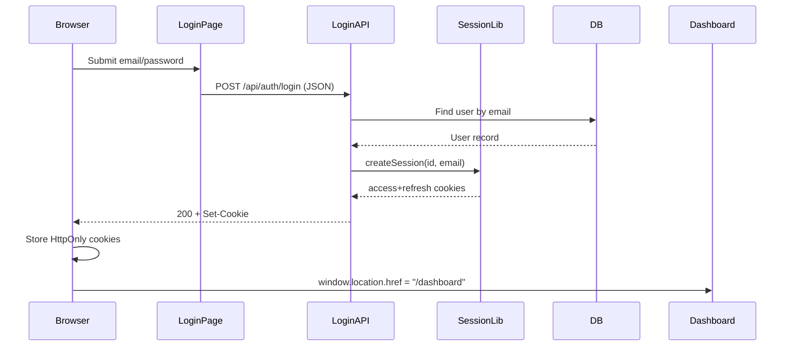
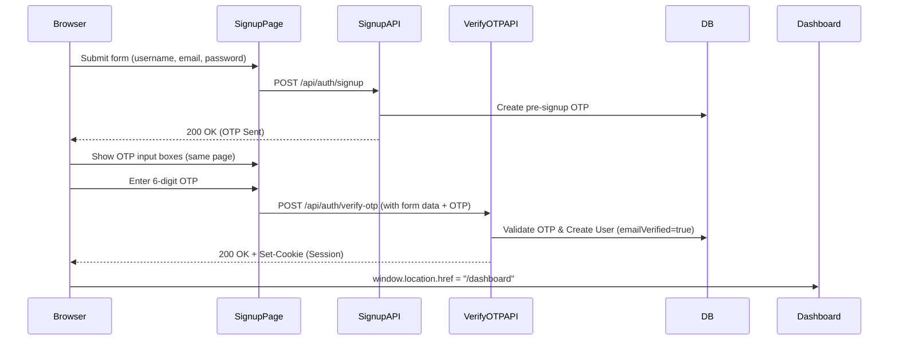
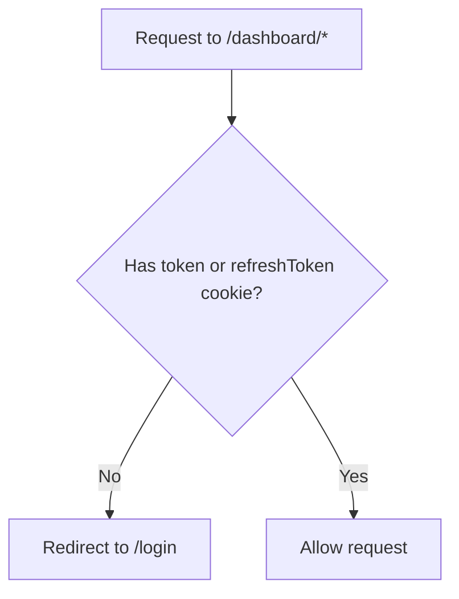
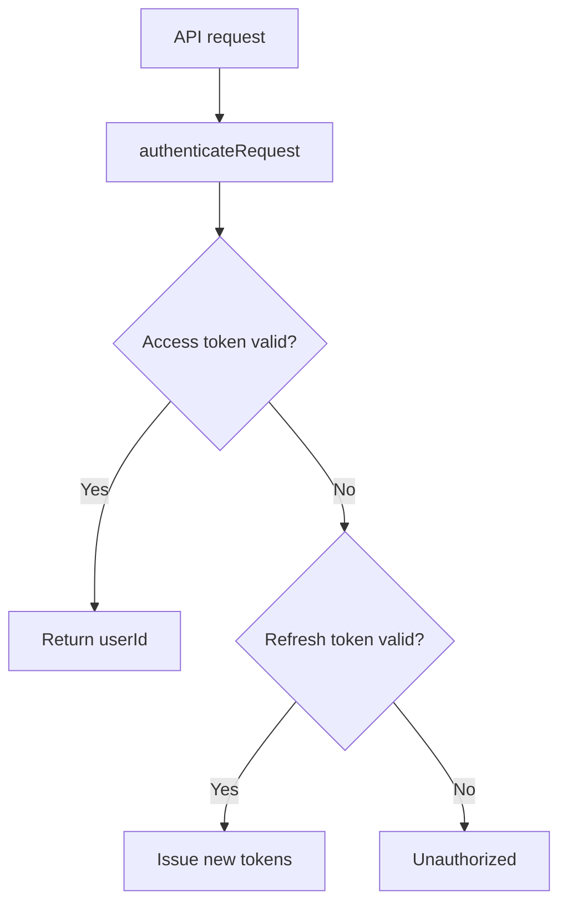
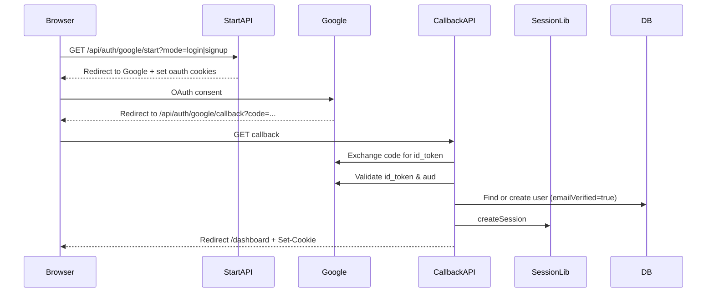
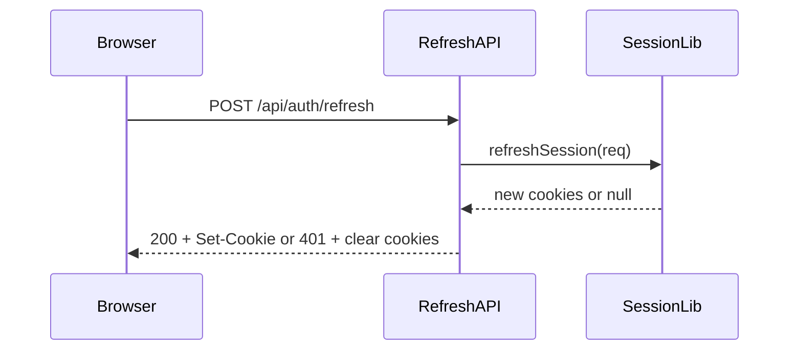

# COREsume — Authentication System Documentation

> **Last updated:** 2026-05-01  
> **Status:** Fully operational ✅

This document describes the current authentication system, how requests flow through it, which files are involved, and what issues were found and fixed. It also includes recommendations on whether to change the implementation.

---

## 1. Overview (Current Design)

- Stateless JWT session using two HttpOnly cookies:
  - `token` (access token, default 1 hour)
  - `refreshToken` (refresh token, default 7 days)
- Cookies are set on successful login/signup/Google OAuth callbacks.
- Protected routes are guarded in middleware (currently by cookie presence only).
- API routes verify JWTs and optionally refresh tokens.

---

## 2. File Map (What Owns What)

- **Auth cookies + JWT signing/verification:** `lib/auth/token.js`
- **Session creation and verification:** `lib/auth/session.js`
- **Route protection (middleware):** `middleware.js`
- **Login UI:** `app/login/page.jsx`
- **Signup UI (Form + OTP):** `app/signup/page.jsx` (Single-page flow)
- **Forgot Password UI:** `app/forgot-password/page.jsx`
- **Email/password login endpoint:** `app/api/auth/login/route.js`
- **Signup endpoints:** 
  - Send OTP: `app/api/auth/signup/route.js`
  - Verify OTP & Create User: `app/api/auth/verify-otp/route.js`
- **Forgot Password endpoints:**
  - Send OTP: `app/api/password/forgot-password-send-otp/route.js`
  - Verify OTP: `app/api/password/forgot-password-verify-otp/route.js`
  - Reset: `app/api/password/reset-password/route.js`
- **Google OAuth start/callback:** `app/api/auth/google/start/route.js` and `app/api/auth/google/callback/route.js`
- **Refresh endpoint:** `app/api/auth/refresh/route.js`
- **Logout endpoint:** `app/api/logout/route.js`

*(Note: The legacy files `send-otp/route.js`, `resend-otp/route.js`, and `verify-email/page.jsx` have been permanently deleted as they are no longer used).*

---

## 3. Cookie + JWT Details

- Cookies are created in `buildSessionCookies()` inside `lib/auth/token.js`:
  - `httpOnly: true` (Never accessible by JavaScript)
  - `sameSite: "lax"` (CSRF protection)
  - `secure: process.env.NODE_ENV === "production"` (Requires HTTPS in production)
  - `path: "/"`
  - `maxAge` for access and refresh
- JWTs are signed with:
  - `JWT_SECRET` for access token
  - `JWT_REFRESH_SECRET` (or `JWT_SECRET` fallback) for refresh token
- Token expiration defaults:
  - Access: `1h`
  - Refresh: `7d`

---

## 4. High-Level Flow Diagrams

### 1) Email/Password Login
Login is purely email + password. **No OTP at any stage.**


*(Note: `window.location.href` is used instead of `router.push` to force a full browser navigation so the Edge middleware sees the newly set HttpOnly cookies).*

### 2) Email/Password Signup (Two-Step, Single Page)
Signup requires verifying email ownership via OTP **before** creating the user.



### 3) Middleware Protection (Edge Runtime)



### 4) API Route Auth (Token Verification)



### 5) Google OAuth Login/Signup



### 6) Refresh Session



---

## 5. Bug History — The 500 Error & What Was Fixed

### Symptom
- `POST /api/auth/signup` returned **500 Internal Server Error** on every signup attempt (~2s response time).
- Users logging in successfully were being incorrectly redirected back to `/login` when attempting to access `/dashboard`.

### Root Cause 1 — Prisma Client Out of Sync
The `emailVerified` field was added to the `User` model in `prisma/schema.prisma` but **`prisma generate` was never re-run**. 
Also, the `Otp` model declared a relation to `User`, but `User` had no corresponding `otps Otp[]` back-relation field. This caused both `prisma generate` and runtime Prisma client calls to fail.

### Root Cause 2 — Edge Middleware Limitation
Middleware originally called `authenticateRequest()` which uses `jsonwebtoken` for JWT verification. Next.js middleware runs on the **Edge runtime**, where `jsonwebtoken` is not supported. This caused verification to fail silently, triggering redirects to `/login` even with valid cookies.

### Current Fixes Applied (Now Live)
1. **Schema & DB Sync:** Added missing back-relations and synced the database using `npx prisma db push --accept-data-loss` and `npx prisma generate`.
2. **Middleware:** Middleware now **only checks for cookie presence** and does not verify JWTs in the Edge runtime. Full JWT verification happens safely inside API routes (`/api/user/info`, etc.).
3. **Flow Refactoring:** Rewrote the entire signup architecture into the single-page, OTP-first flow detailed in Diagram 2 above. Removed legacy `verify-email` and `send-otp` route files.

---

## 6. Database Schema — Auth Models

```prisma
model User {
  id            Int      @id @default(autoincrement())
  username      String
  email         String   @unique
  password      String                // bcrypt hash | random UUID for Google users
  authProvider  String   @default("password")  // "password" | "google"
  emailVerified Boolean  @default(true)
  //   ^^ defaults true so existing users aren't locked out.
  //      New password users are created with emailVerified: true because the OTP 
  //      is verified BEFORE the account is created.
  otps          Otp[]                 // required back-relation for Prisma
  creds         Int      @default(0)
}

model Otp {
  id        String   @id @default(cuid())
  email     String
  code      String                    // 6-digit string (plain text)
  createdAt DateTime @default(now())
  expiresAt DateTime                  // now() + 10 minutes at creation time
  purpose   String   @default("signup") // "pre-signup" | "forgot-password"
  userId    Int?                      // nullable — no user exists yet for pre-signup OTPs
  user      User?    @relation(fields: [userId], references: [id], onDelete: Cascade)
}
```