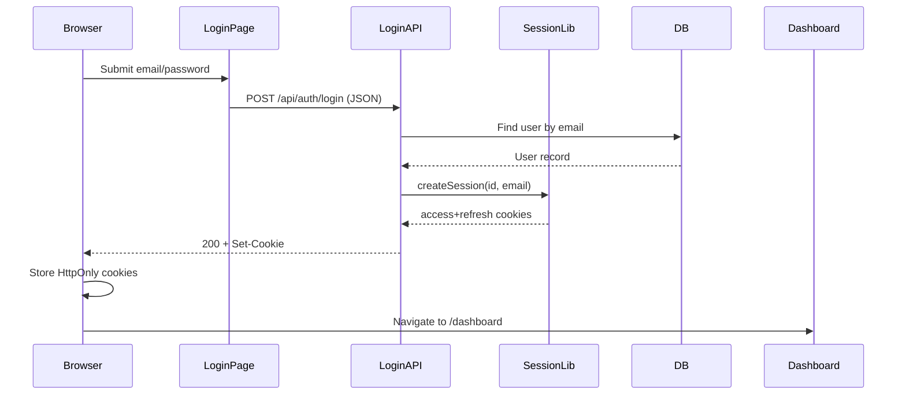
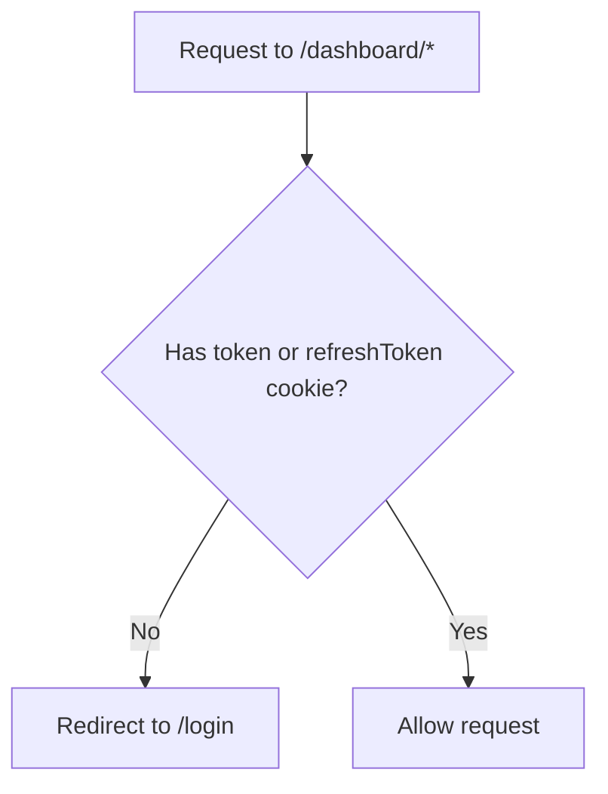
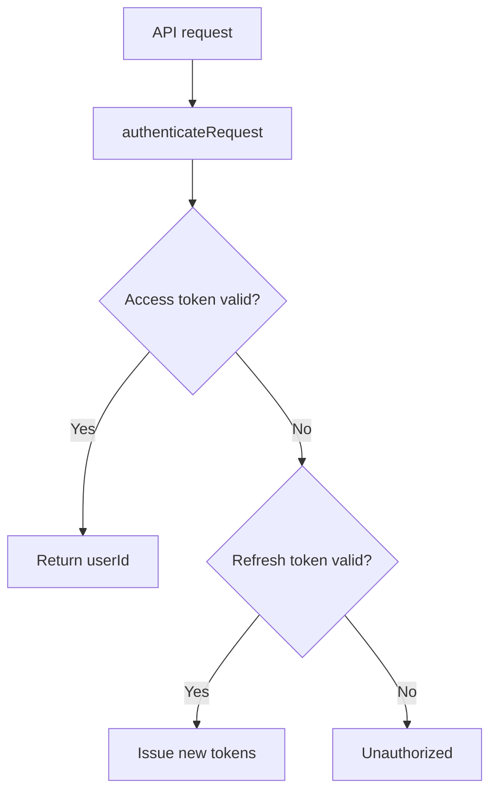
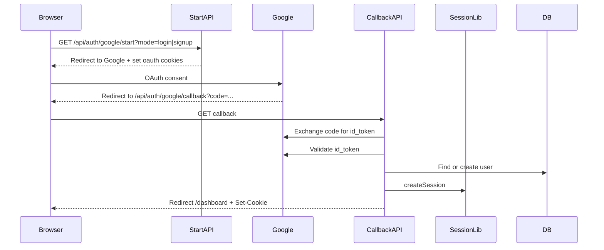
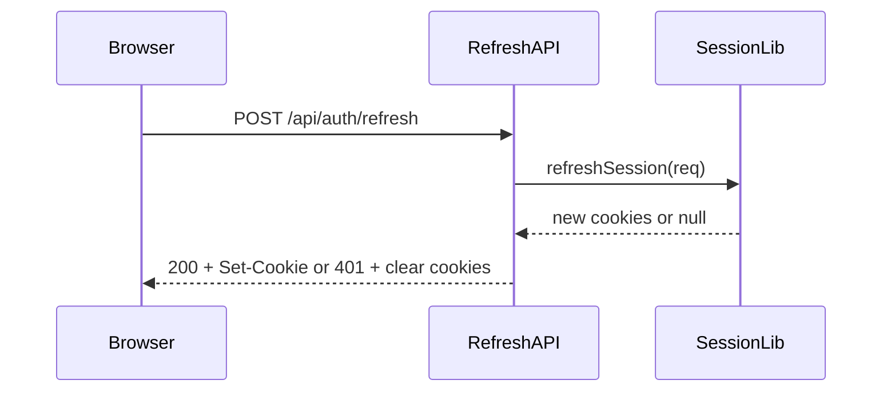

# Authentication

This document describes the current authentication system, how requests flow through it, which files are involved, and what issues were found. It also includes recommendations on whether to change the implementation.

## Overview (current design)

- Stateless JWT session using two HttpOnly cookies:
  - `token` (access token, default 1 hour)
  - `refreshToken` (refresh token, default 7 days)
- Cookies are set on successful login/signup/Google OAuth callbacks.
- Protected routes are guarded in middleware (currently by cookie presence only).
- API routes verify JWTs and optionally refresh tokens.

## File map (what owns what)

- Auth cookies + JWT signing/verification: [lib/auth/token.js](lib/auth/token.js)
- Session creation and verification: [lib/auth/session.js](lib/auth/session.js)
- Route protection (middleware): [middleware.js](middleware.js)
- Login UI + POST to login endpoint: [app/login/page.jsx](app/login/page.jsx)
- Signup UI + POST to signup endpoint: [app/signup/page.jsx](app/signup/page.jsx)
- Email/password login endpoint: [app/api/auth/login/route.js](app/api/auth/login/route.js)
- Email/password signup endpoint: [app/api/auth/signup/route.js](app/api/auth/signup/route.js)
- OTP signup endpoints: [app/api/auth/send-otp/route.js](app/api/auth/send-otp/route.js) and [app/api/auth/verify-otp/route.js](app/api/auth/verify-otp/route.js)
- Google OAuth start/callback: [app/api/auth/google/start/route.js](app/api/auth/google/start/route.js) and [app/api/auth/google/callback/route.js](app/api/auth/google/callback/route.js)
- Refresh endpoint: [app/api/auth/refresh/route.js](app/api/auth/refresh/route.js)
- Logout endpoint: [app/api/logout/route.js](app/api/logout/route.js)
- Authenticated user data:
  - [app/api/user/info/route.js](app/api/user/info/route.js)
  - [app/api/user/credits/route.js](app/api/user/credits/route.js)

## Cookie + JWT details

- Cookies are created in `buildSessionCookies()` inside `lib/auth/token.js`:
  - `httpOnly: true`
  - `sameSite: "lax"`
  - `secure: process.env.NODE_ENV === "production"`
  - `path: "/"`
  - `maxAge` for access and refresh
  - Note: `secure: true` in production requires HTTPS or the browser will drop cookies.
- JWTs are signed with:
  - `JWT_SECRET` for access token
  - `JWT_REFRESH_SECRET` (or `JWT_SECRET` fallback) for refresh token
- Token expiration defaults:
  - Access: `1h`
  - Refresh: `7d`

## High-level flow diagrams

### 1) Email/password login

### 2) Middleware protection (current)

### 3) API route auth (token verification)

### 4) Google OAuth login/signup

### 5) Refresh

## What happens today (per file)

### Login UI
- [app/login/page.jsx](app/login/page.jsx)
- Submits to `/api/auth/login` with `credentials: "include"`.
- After success, uses `window.location.href = "/dashboard"` for a full reload so middleware sees the HttpOnly cookies.

### Login API
- [app/api/auth/login/route.js](app/api/auth/login/route.js)
- Validates user + bcrypt password.
- Creates session cookies with `createSession`.
- Returns 200 with `Set-Cookie` for `token` and `refreshToken`.

### Signup UI
- [app/signup/page.jsx](app/signup/page.jsx)
- Posts to `/api/auth/signup`.
- Redirects via `router.push("/dashboard")`.

### Signup API
- [app/api/auth/signup/route.js](app/api/auth/signup/route.js)
- Creates a user, hashes password.
- Sets session cookies (same as login).

### OTP signup
- [app/api/auth/send-otp/route.js](app/api/auth/send-otp/route.js) sends a one-time code.
- [app/api/auth/verify-otp/route.js](app/api/auth/verify-otp/route.js) verifies OTP, creates user, sets cookies.

### Google OAuth
- [app/api/auth/google/start/route.js](app/api/auth/google/start/route.js) starts OAuth and sets state cookies.
- [app/api/auth/google/callback/route.js](app/api/auth/google/callback/route.js) validates token, creates user if needed, sets cookies, redirects to `/dashboard`.

### Middleware
- [middleware.js](middleware.js)
- Guards `"/dashboard"`, `"/resume-form"`, `"/resume-preview"`, and `"/admin"`.
- **Current behavior**: checks only for the presence of `token` or `refreshToken` cookies and allows access if present.

### Authenticated API routes
- [app/api/user/info/route.js](app/api/user/info/route.js) verifies JWTs and optionally refreshes.
- [app/api/user/credits/route.js](app/api/user/credits/route.js) verifies JWTs and optionally refreshes.

### Logout
- [app/api/logout/route.js](app/api/logout/route.js) clears cookies via `buildClearSessionCookies()`.

## Resolved issue (root cause)

### Symptom
- Users can log in successfully and receive valid cookies, but are redirected back to `/login` when attempting to access `/dashboard`.

### Cause
- Middleware originally called `authenticateRequest()` which uses `jsonwebtoken` for JWT verification.
- Next.js middleware runs on the **Edge runtime**, where `jsonwebtoken` is not supported.
- This caused verification to fail silently, which triggered redirects to `/login` even with valid cookies.

### Current fix applied (now live)
- Middleware now **only checks for cookie presence** and does not verify JWTs in Edge runtime.
- Full JWT verification happens inside API routes (`/api/user/info`, `/api/user/credits`, etc.).

## Is the current auth OK or should it change?

### Short answer
- The current design is workable and safe enough for many projects **if** you accept stateless tokens and validate in API routes.
- However, there are important improvements you should consider for correctness, security, and maintainability.

### What is OK today
- Cookies are HttpOnly and SameSite Lax.
- Passwords are bcrypt hashed.
- Access + refresh tokens are separated.
- Refresh route returns new cookies and clears cookies on invalid refresh tokens.

### What should be changed (recommended)

1) **Middleware verification should stay cookie-only**
   - Edge runtime cannot use `jsonwebtoken`.
   - Option: move JWT verification into a standard Node runtime (API routes) or use Edge-compatible JWT libs (or NextAuth).

2) **Signup page should use full reload after success**
   - `router.push("/dashboard")` may still race against cookie persistence.
   - Use `window.location.href = "/dashboard"` for consistency (like login).

3) **Token revocation is not supported**
   - `invalidateRefreshToken()` is empty.
   - Logout only clears cookies; previously issued refresh tokens remain valid until expiry.
   - Consider storing refresh token IDs server-side or using a rotation strategy.

4) **Refresh token rotation**
   - Refresh currently issues new tokens but does not invalidate old ones.
   - Consider a rotation scheme to reduce replay risk.

5) **CSRF considerations**
   - SameSite Lax helps, but consider CSRF tokens for state-changing endpoints.

6) **Observability**
   - Keep debug logs off in production.
   - Consider structured logging around auth failures.

## Recommendation summary

- **Keep** the current cookie + JWT architecture if you want minimal changes.
- **Keep** middleware as cookie-only presence checks (required for Edge runtime).
- **Improve** signup navigation and implement refresh token rotation and revocation if you want stronger security.

## How to validate in local dev

1) Login and confirm cookies are set (Application tab in DevTools).
2) Access `/api/user/info` and confirm it returns 200 with user data.
3) Navigate to `/dashboard` and confirm you are not redirected to `/login`.

## Optional next steps (if you want a stronger system)

- Move to a library like NextAuth/Auth.js for a supported, Edge-aware auth system.
- Store refresh tokens in the database with rotation and revoke on logout.
- Add token versioning to invalidate old sessions on password reset.
- Centralize auth checks into a single API guard helper.
